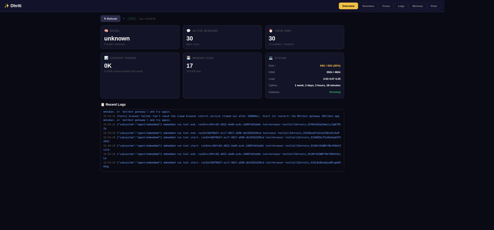
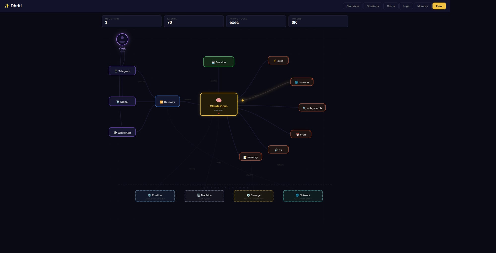
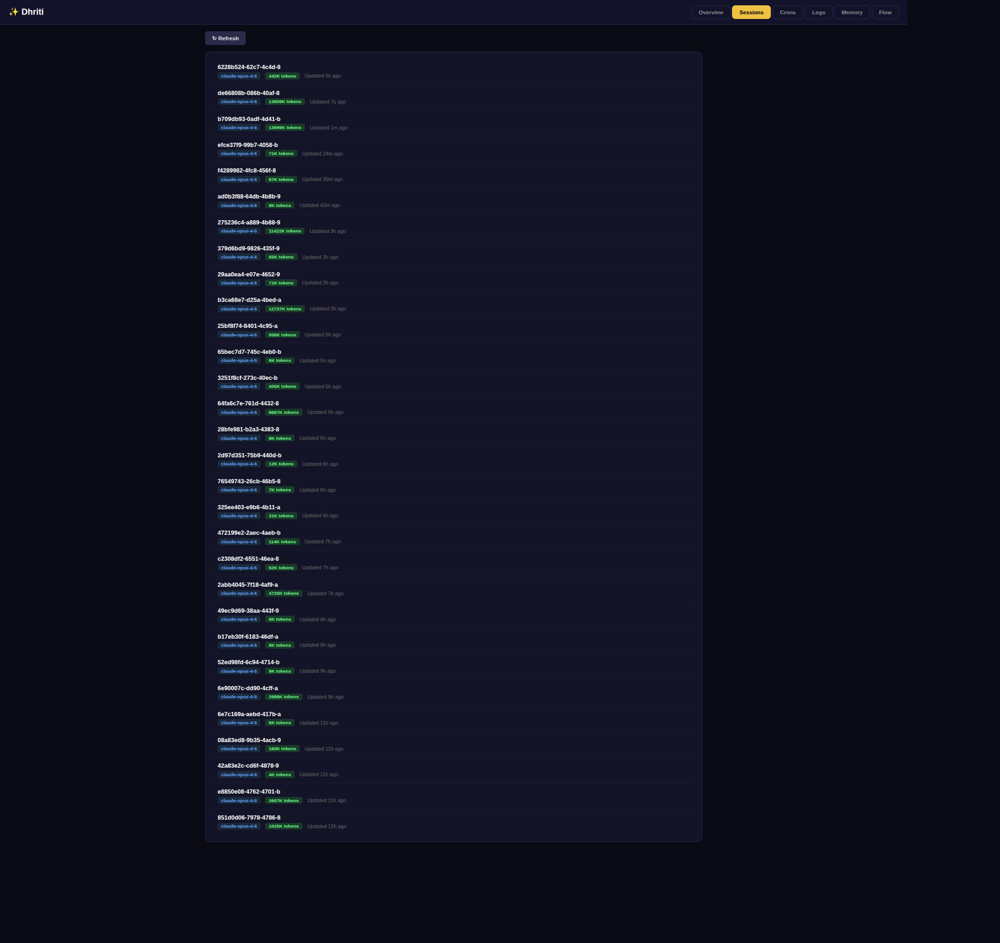
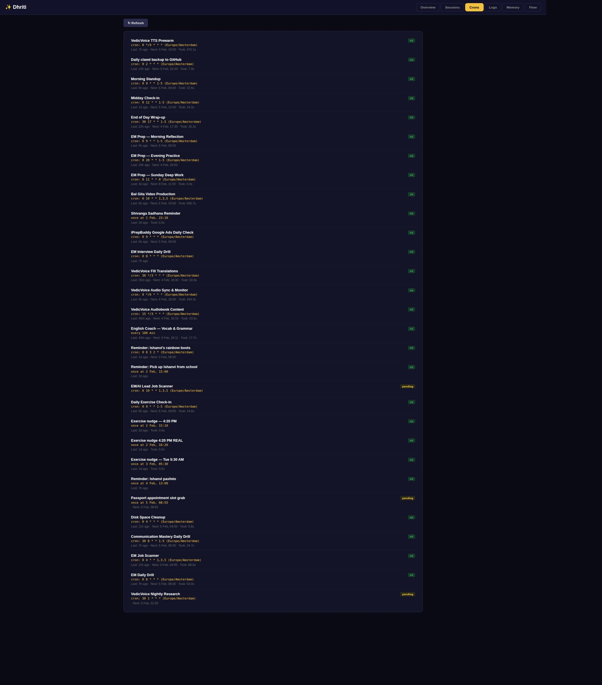
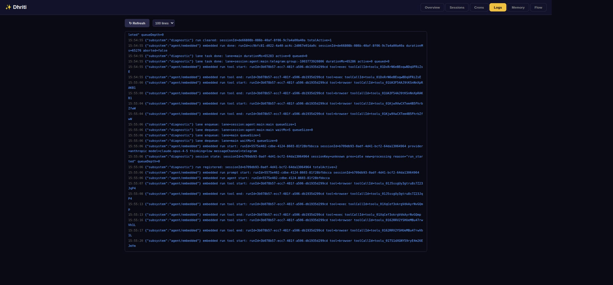
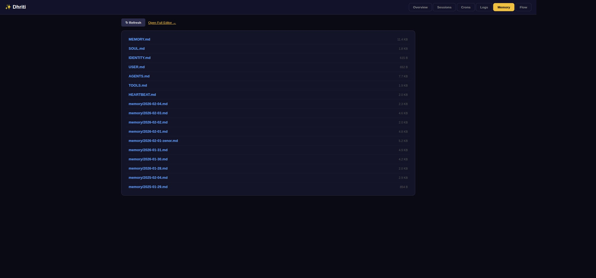

# 🦞 OpenClaw Dashboard

**See your agent think.**

Real-time observability dashboard for [OpenClaw](https://github.com/nicobailon/openclaw)/[Moltbot](https://github.com/nicobailon/moltbot) AI agents. One file. Zero config. Just run it.



---

## ⚡ Quick Start

```bash
pip install openclaw-dashboard
openclaw-dashboard
```

Or run directly:

```bash
pip install flask
python3 dashboard.py
```

Opens at **http://localhost:8900** — auto-detects your OpenClaw workspace.

---

## 📸 Screenshots

<table>
<tr>
<td align="center"><strong>Overview</strong><br></td>
<td align="center"><strong>Flow Visualization</strong><br></td>
</tr>
<tr>
<td align="center"><strong>Sessions</strong><br></td>
<td align="center"><strong>Cron Jobs</strong><br></td>
</tr>
<tr>
<td align="center"><strong>Live Logs</strong><br></td>
<td align="center"><strong>Memory Files</strong><br></td>
</tr>
</table>

---

## ✨ Features

| Tab | What it shows |
|-----|--------------|
| **Overview** | Model, active sessions, cron jobs, context tokens, memory files, system health, recent logs |
| **Sessions** | All active agent sessions with model, channel, token usage, last activity |
| **Crons** | Scheduled jobs with status, schedule, last run, next run, duration |
| **Logs** | Parsed JSON logs with color-coded levels, configurable line count, **real-time SSE streaming** |
| **Memory** | Clickable file browser for SOUL.md, MEMORY.md, AGENTS.md, daily memory files |
| **Flow** | **Real-time animated SVG** showing data flow: You → Channels → Gateway → Brain → Tools → Infrastructure |

### Flow Visualization

The Flow tab is the star — a live animated architecture diagram that lights up in real-time as your agent processes messages:

- 🟣 **Purple particles** — your message entering through a channel
- 🔵 **Blue particles** — request flowing to the brain
- 🟡 **Yellow particles** — tool calls (exec, browser, search, cron, tts, memory)
- 🟢 **Green particles** — response flowing back to you
- 🔴 **Red flash** — errors
- 🔵 **Cyan pulses** — infrastructure layer activity (network, storage, runtime)

---

## ⚙️ Configuration

### CLI Arguments

```bash
openclaw-dashboard --port 9000          # Custom port (default: 8900)
openclaw-dashboard --host 127.0.0.1     # Bind to localhost only
openclaw-dashboard --workspace ~/mybot  # Custom workspace path
openclaw-dashboard --log-dir /var/log   # Custom log directory
openclaw-dashboard --name "Alice"       # Your name in Flow visualization
```

### Environment Variables

| Variable | Description | Default |
|----------|-------------|---------|
| `OPENCLAW_HOME` | Agent workspace directory | Auto-detected |
| `OPENCLAW_WORKSPACE` | Alternative to OPENCLAW_HOME | Auto-detected |
| `OPENCLAW_LOG_DIR` | Log directory | `/tmp/moltbot` |
| `OPENCLAW_USER` | Your name in Flow tab | `You` |

### Auto-Detection

If no paths are configured, the dashboard automatically searches for:

1. **Workspace**: Checks `~/.clawdbot/agents/main/config.json` → `~/.clawdbot/workspace` → `~/clawd` → `~/openclaw` → current directory. Looks for `SOUL.md`, `AGENTS.md`, `MEMORY.md`, or `memory/` directory.
2. **Logs**: Checks `/tmp/moltbot` → `/tmp/openclaw` → `~/.clawdbot/logs`
3. **Sessions**: Reads from `~/.clawdbot/agents/main/sessions/`
4. **Crons**: Reads from `~/.clawdbot/cron/jobs.json`

---

## 🏗️ How It Works

The dashboard is a single-file Flask app that reads directly from your OpenClaw/Moltbot data directories:

```
Your Agent (Moltbot)          OpenClaw Dashboard
┌─────────────────┐          ┌─────────────────┐
│ Writes logs to   │─────────▶│ Reads & parses   │
│ /tmp/moltbot/    │          │ JSON log lines   │
│                  │          │                  │
│ Stores sessions  │─────────▶│ Lists sessions   │
│ in ~/.clawdbot/  │          │ with metadata    │
│                  │          │                  │
│ Saves crons to   │─────────▶│ Shows schedules  │
│ cron/jobs.json   │          │ and status       │
│                  │          │                  │
│ Agent workspace  │─────────▶│ Browses memory   │
│ SOUL.md, etc.    │          │ files inline     │
└─────────────────┘          └─────────────────┘
```

**Real-time streaming** uses `tail -f` piped through Server-Sent Events (SSE) — no WebSockets, no dependencies, just works.

---

## 📦 Installation Options

### pip (recommended)

```bash
pip install openclaw-dashboard
openclaw-dashboard
```

### From source

```bash
git clone https://github.com/vivekchand/openclaw-dashboard.git
cd openclaw-dashboard
pip install -r requirements.txt
python3 dashboard.py
```

### One-liner

```bash
curl -sSL https://raw.githubusercontent.com/vivekchand/openclaw-dashboard/main/install.sh | bash
```

---

## 🔧 Requirements

- **Python 3.8+**
- **Flask** (only dependency)
- **OpenClaw/Moltbot** running on the same machine (reads its logs and state files)
- Linux/macOS (uses `tail`, `df`, `free`, `/proc/loadavg`)

---

## 📄 License

MIT — do whatever you want with it.

---

## 🙏 Credits

- Built by [Vivek Chand](https://linkedin.com/in/vivekchand46) as part of the OpenClaw ecosystem
- Powered by [OpenClaw](https://github.com/nicobailon/openclaw) and [Moltbot](https://github.com/nicobailon/moltbot)
- The Flow visualization was inspired by watching an AI agent actually think

---

<p align="center">
  <strong>🦞 See your agent think</strong><br>
  <sub>Star this repo if you find it useful!</sub>
</p>
